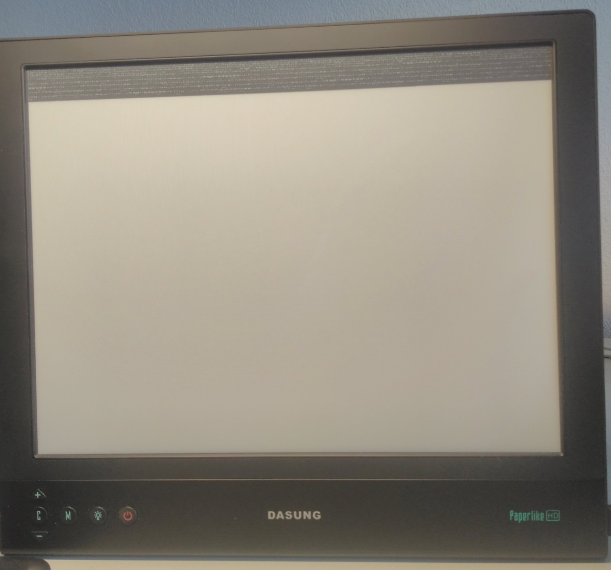
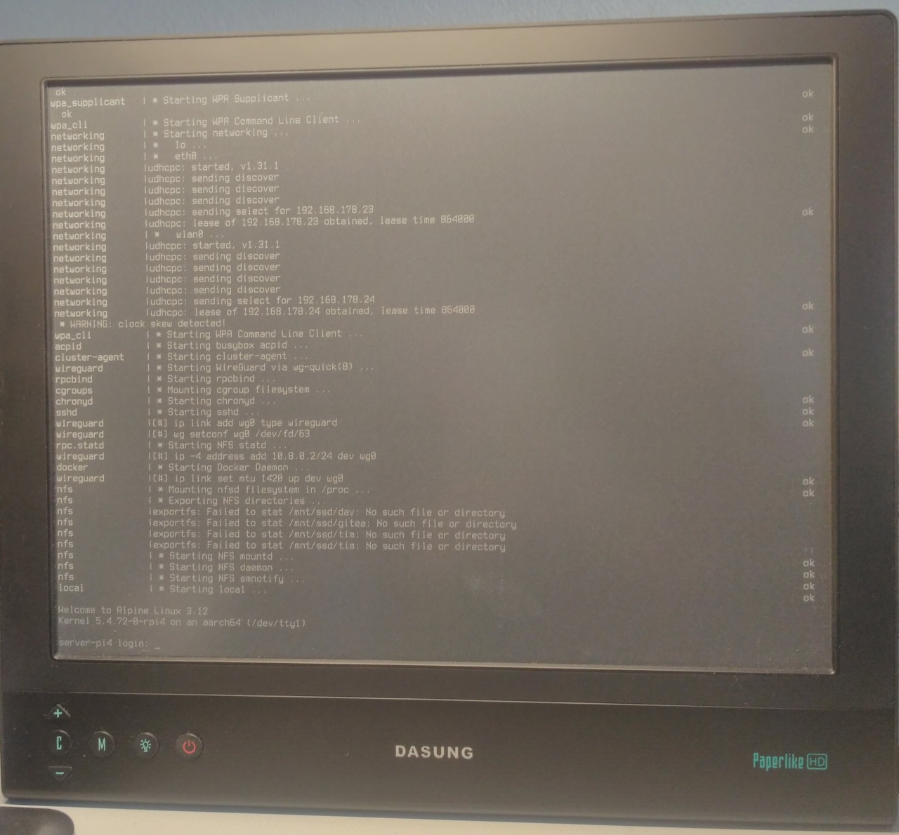

+++
title       = "Configuring HDMI output on a Raspberry Pi 4"
published   = 2020-11-01
language    = "en-GB"
categories  = ["devops", "linux"]
description = "How to configure Raspberry Pi 4 servers such that an HDMI monitor can be hot-plugged"
+++

# Introduction
Connecting an HDMI monitor to a laptop or television typically does not require any special configuration. One might assume the same to be the case for a Raspberry Pi. However, the Pi being a single-board computer, its behaviour does differ in various ways from consumer electronics.

A key difference is that hot-plugging monitors to a Pi is only supported if the system had already been booted with a monitor attached. Otherwise, no signal will be transmitted when attaching a monitor later on. Since many Pi installations are headless, this does reduce their power consumption and increases security by preventing potential information leaks.

If the Pi is operated as a server and located in a safe environment, HDMI access without having to necessarily reboot is still desirable. To investigate kernel crashes or connectivity issues, being able to hook up a monitor on-the-fly will avoid having to use a serial connection.

Gladly, the Pi is highly configurable and lets us fully customise the HDMI output. This article discusses all the steps required for a persistent HDMI configuration specific to your monitor, allowing you to hot-plug whenever direct access is needed. 

# Setup
I recently acquired an HiDPI e-Ink monitor ([DASUNG Paperlike HD](http://www.dasungtech.com/)) which is attached to an HDMI switch ([HuTools 4K HDMI Switch](https://www.amazon.com/Splitter-HuTools-Bi-Directional-Switcher-Supports/dp/B07TT4Y6VG)) that receives inputs from a laptop and Pi 4. This allows me to change the monitor's input with the press of a button.

The downside of this setup is that the HDMI monitor only appears to the Pi 4 as connected when the HDMI switch uses the corresponding input. Having an e-Ink monitor further complicates matters as the Paperlike uses an unconventional resolution.

# First attempt
The Raspberry Pi Foundation offers a set of Pi-specific tools, one of which being `tvservice`. Its purpose is to configure the HDMI output on-the-fly. The `-p` flag is supposed to enable the HDMI port using Pi's "preferred" settings. Unfortunately, it does not work when the Pi was already started without an HDMI cable attached. Despite the shell output suggesting otherwise, the command did not have any effect:

```shell
$ /opt/vc/bin/tvservice -p
Powering on HDMI with preferred settings
```

Further investigation showed that `/dev/fb0` is missing. Thus, no framebuffer is available to the kernel. This indicates that the kernel did not find any video output during initialisation.

# Enabling hot-plugging
To expose HDMI output to the kernel during boot time regardless of whether a cable had been attached, we can explicitly enable a firmware setting for hot-plugging.

For all settings in this article, we will edit either `usercfg.txt` or `config.txt` which are located on the boot partition. For hot-plugging, add the following line:

```shell
hdmi_force_hotplug=1
```

This should work fine for most monitors, but caused problems with the Paperlike. After a reboot, it does show an output when hot-plugged, albeit distorted:



It appears that the Pi does not consider the EDID information to retrieve the screen resolution of hot-plugged monitors. Since the monitor runs on an unconventional resolution and refresh rate, Pi's default is likely to be incompatible.

Even when connecting the monitor before the initial boot, the Raspberry Pi fails to configure the virtual terminal correctly. Only a part of the available screen will be occupied:


According to the [documentation](https://www.raspberrypi.org/documentation/configuration/config-txt/video.md), the firmware should read the monitor's EDID during firmware initialisation. The Pi selected the first mode supported by the monitor (1600x1200 @ 60 Hz) rather than the second one which features a higher resolution (2200x1650 @ 40 Hz) and would fill the whole space.

The solution to both problems is to override the setting to always use the second mode 2200x1650 @ 40 Hz.

# Setting timing configuration
The boot firmware uses the default `hdmi_mode=0` which auto-detects the HDMI timing settings from the monitor's EDID information, but it will not read the EDID settings when hot-plugging a monitor. As a remedy, we could hard-code one of the available HDMI modes such as a 28 for 1280x800 @ 60 Hz. However, none of the presets match exactly the resolution supported by the Paperlike monitor.

As an alternative, HDMI's raw timings can be set directly with [`hdmi_timings`](https://www.raspberrypi.org/documentation/configuration/config-txt/video.md). It has the following syntax:

`hdmi_timings=<h_active_pixels> <h_sync_polarity> <h_front_porch> <h_sync_pulse> <h_back_porch> <v_active_lines> <v_sync_polarity> <v_front_porch> <v_sync_pulse> <v_back_porch> <v_sync_offset_a> <v_sync_offset_b> <pixel_rep> <frame_rate> <interlaced> <pixel_freq> <aspect_ratio>`

These are a lot of obscure parameters and the monitor's manual did not even contain any of them. We can retrieve all relevant values from the EDID information and use the recommended defaults for the rest. To read out the monitor's EDID information, you can use the `edid-decode` command which gave this output for the Paperlike monitor:

```shell
$ edid-decode < /sys/class/drm/card0-DP-1/edid
[...]
  Detailed Timing Descriptors:
    DTD 1:  2200x1650   40.001 Hz   4:3    67.842 kHz 160.650 MHz (200 mm x 150 mm)
                 Hfront   56 Hsync  32 Hback  80 Hpol P
                 Vfront    3 Vsync   6 Vback  37 Vpol P
    Dummy Descriptor:
    Display Product Name: 'Paperlike H D'
    DTD 2:  1600x1200   60.000 Hz   4:3    75.000 kHz 162.000 MHz (621 mm x 341 mm)
                 Hfront   64 Hsync 192 Hback 304 Hpol P
                 Vfront    1 Vsync   3 Vback  46 Vpol P
```

Since we want to drive the monitor at the highest resolution, we will use DTD 2 and put in the values into the `hdmi_timings` command. To test the configuration without having to reboot, we can log into the Pi 4 via SSH and run this Python script:

```python
#!/usr/bin/env python3
import os

h, v = (2200, 1650)
frame_rate = 40 # Hz

aspect_ratio = 1 # 4:3

h_front_porch = 56
h_sync_pulse  = 32
h_back_porch  = 80

v_front_porch = 3
v_sync_pulse  = 6
v_back_porch  = 37

pixel_freq = h * v * frame_rate

# See https://www.raspberrypi.org/documentation/configuration/config-txt/video.md
timings=f"{h} 1 {h_front_porch} {h_sync_pulse} {h_back_porch} {v} 1 {v_front_porch} {v_sync_pulse} {v_back_porch} 0 0 0 {frame_rate} 0 {pixel_freq} 1"
print(timings)

hdmi_timings = f"/opt/vc/bin/vcgencmd hdmi_timings {timings}"
os.system(hdmi_timings)

# Sets hdmi_group=2 and hdmi_mode=87
os.system("/opt/vc/bin/tvservice -e 'DMT 87'")

# See https://github.com/raspberrypi/firmware/issues/792#issuecomment-292318302
os.system("fbset -depth 8")
os.system("fbset -depth 16")

# Switch between VTs, otherwise screen will turn black
os.system("chvt 2")
os.system("chvt 1")
```

If all values were put in correctly, the terminal will be visible now.

## Screen resolution
You will see that the framebuffer still uses the wrong resolution with only the top left corner occupied:


While the HDMI port is set up correctly, the framebuffer is not. Running the `fbset` command shows the wrong resolution indeed:

```shell
$ fbset

mode "640x480-0"
	# D: 0.000 MHz, H: 0.000 kHz, V: 0.000 Hz
	geometry 640 480 640 480 16
	timings 0 0 0 0 0 0 0
	accel true
	rgba 5/11,6/5,5/0,0/0
endmode
```

Due to a [kernel limitation](https://github.com/raspberrypi/linux/issues/3391), it is not possible to increase the resolution:

```shell
$ fbset -g 2200 1650 2200 1650 16
fbset: ioctl 0x4601 failed: Invalid argument
```

But if we persist the configuration, the framebuffer should be set up correctly during boot.

## Persisting settings
To apply the outlined settings when starting the Pi, change the boot configuration and adapt `hdmi_timings` to match your monitor:

```shell
dtoverlay=vc4-fkms-v3d
hdmi_force_hotplug=1
hdmi_group=2  # DMT
hdmi_mode=87  # Set raw timings
hdmi_timings=2200 1 56 32 80 1650 1 3 6 37 0 0 0 40 0 145200000 1
```

After a reboot, the entire screen should be occupied. If we now run `fbset`, it will report the correct resolution:

```shell
$ fbset

mode "2200x1650-0"
	# D: 0.000 MHz, H: 0.000 kHz, V: 0.000 Hz
	geometry 2200 1650 2200 1650 16
	timings 0 0 0 0 0 0 0
	accel true
	rgba 5/11,6/5,5/0,0/0
endmode
```

This is how it looks:


# Font size
Finally, you may have noticed in the pictures that the font size is quite readable for an HiDPI screen. This is because the terminal is configured to use the Terminus font with larger glyphs.

On Alpine Linux, this can be achieved as follows:

```shell
$ apk add terminus-font
```

To use the Terminus font with 16x32px glyphs, run:

```shell
$ setfont /usr/share/consolefonts/ter-v32n.psf.gz -C /dev/tty0
```

If you are satisfied, change `/etc/conf.d/consolefont` and then run `rc-update add consolefont boot` to set the font during boot.

# Conclusion
In this article, we have witnessed the flexibility of Pi's boot firmware. It allows us to configure various aspects of the HDMI output to exactly match our setup. Custom HDMI timings are especially useful when using e-Ink monitors that tend to have unorthodox resolutions and refresh rates. While it takes some time to figure out all the options, being able to hot-plug HDMI monitors to an otherwise headless server makes the setup more robust.

The only thing left to be configured is the terminal's background colour to white in order to increase the readability on the e-Ink monitor.
